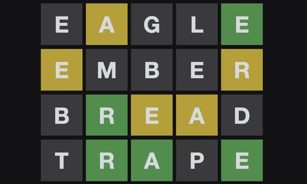
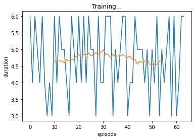
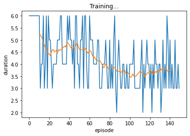
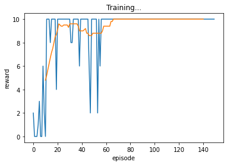
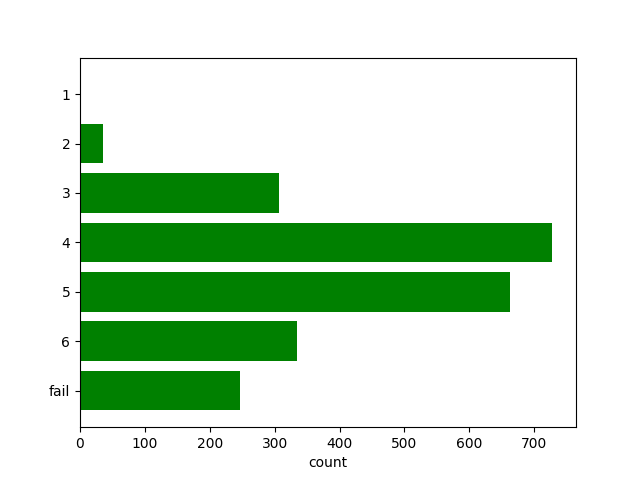
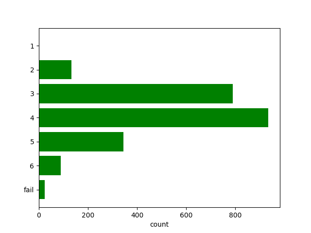
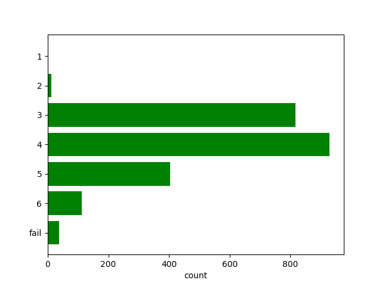

# Wordle Reinforcement Learning

This is a training exercise I set myself to consolidate my RL knowledge after doing RL courses on Coursera.  I created a Naive model (which doesn't use RL) and I am trying to beat its performance by trying various RL methods.  I plan to spend a little time implementing each method, and then take the one that looks the most promising and optimise it.

### A note on wordle
Wordle has a hard-coded list of ~2000 potential target words, and a further ~10000 words which will never be the correct answer, but which the agent/player is allowed to guess.  The 10000 non-target words are a bit obscure, so would make the game too difficult if they were allowed as target words.

## [Naive Approach](Naive.ipynb) 



This is a simple model which doesn't learn.  It uses a given word for the first guess (eg. 'roate', 'oater', 'arose') and then it chooses a random word (from the ~2000 target words) which matches all of the hints given.  It completes a wordle episode in an average of about 4.75 guesses.


## [Q Learning Approach](QLearn.ipynb)




In Q-learning we use a function approximator (an NN or a linear model) to estimate Q, the action value function (ie. Q the value of a given action in a given state).  Q is computed for all 12,000 actions (in this case each word is an action) and an epsilon-greedy policy is used to select the action based on this Q value.

### State and Action Representation
To use the state and action as inputs to the function approximator we need to reprsent them as vectors.

The state is derived from the hints returned by the wordle environment.  It consists of 9 features:
*  The number of green locations we know
*  The number of other letters we know to be in the word
*  The number of letters we know to not be in the word
*  The number of guesses made (encoded as one-hot, so 6 features)

The action is derived from the properties of a word that we might choose to guess next.  It consists of 5 features:
*  whether or not it conforms to the hint history for this episode
*  how many new letters are contained in the word (ie. letters that we haven't already guessed)
*  the number of uniq letters in the word
*  the frequency of the letters in the word

### Reward

The reward for each guessed word will be calculated as follows
*  define a score for the guess as ```score = 2 * num_green_letters + num_orange_letters```
*  calculate the score difference as ```score_delta = score - previous_best_score_in_this_episode```
*  ```reward = max(score_delta, 0)```

### Intial Results

You can see from the duration curve that this seems to beat the Naive model, acheiving about 3.75 guesses per episode.  It frequently chooses the words "oater" or "arose" as the first guess in each episode.  Training is very slow however, because the a lot of computation is required to produce the action vectors (and we have to calculate *all* the action vectors to identify the best candidate).


## Policy Gradient Approach

The aim here is to use a NN to represent the policy, rather than the value function.  We will shrink the action space (ie, so that we have a few actions, rather than 12000).  This will remove the model's ability to learn novel strategies, rather it will just be learning when to employ the different strategies (actions) that I give it.  Start with these 3 actions:

1. choose a word which matches the current history
1. choose a word whose new letters have the highest frequency score
1. choose a word which eliminates the greatest number of candidate target words (NOT IMPLEMENTED YET)

for all these actions there may be multiple words, so sample a random one.  The policy can then be:

1. the average reward calculated directly for each state (using a simplified state which is just the guess number)
1. the probability of each action for each state calculated using the policy gradient theorem (using a simplified state which is just the guess number)
2. a logistic regressor which selects one of these actions to execute.  The loss to train the regressor will be derived using the policy gradient theorem.  The input to the regressor will be all the state vars
1. a nn regressor
1. a hybrid regressor which has a different linear regressor for each guess (each step of the episode)


## Actor-Critic Approach

NOT IMPLEMENTED YET

The aim here is to use a NN to represent the policy *and* the value function. In this case though we will learn the state-value function v.  We will use our estimate of the value function to train the policy network.  We will use the same actions as the policy gradient approach. 


# Outcomes

To test the different approaches, I ran trained models against every possible target word, and calculated a histogram (like the wordle website shows you after every episode).

## Naive Model



average duration 4.731 steps

## Q-Learning Model



average duration 3.799 steps

## Policy Gradient Models



average duration 3.955 steps

The q-learning model wins.  But PG also beat the naive model.


# Futher Work

1. implement the 3rd action for the policy models
1. implement actor-critic
1. refactor the final experiment so that a single function is runs all the models.  This will be more scientific, and ensure that there are no differences in the way that the final test is run.
